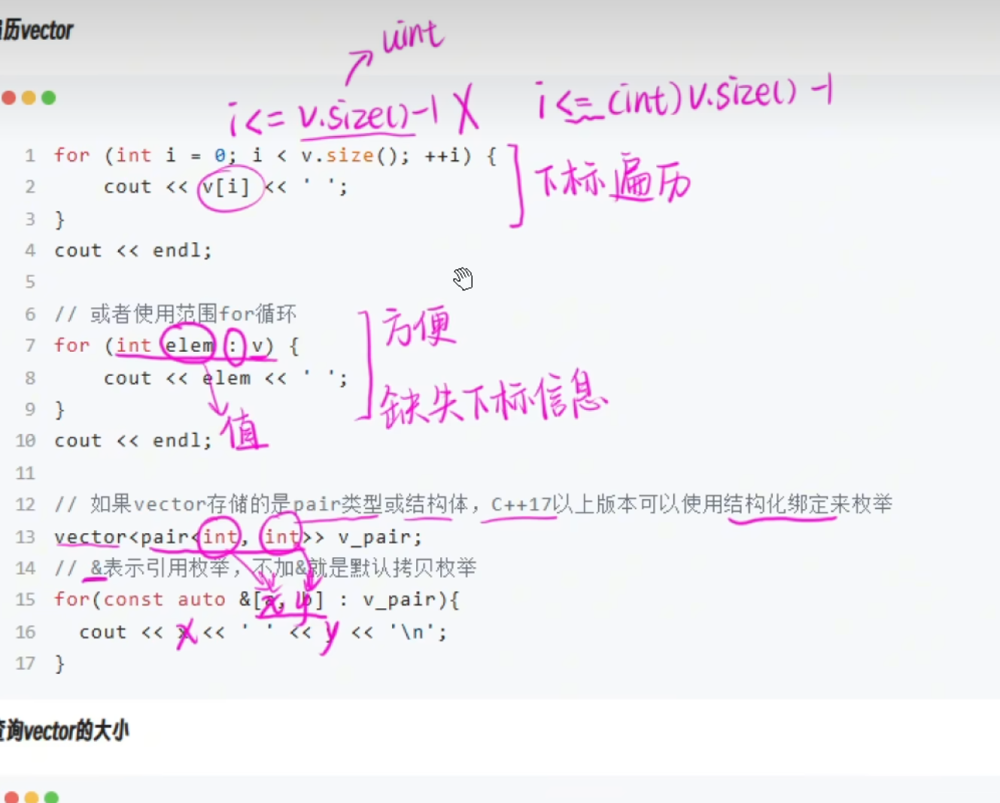

#include<cstring>
就是在c语言的头文件去掉.h加个c
#include<cmath>

getline(cin,s)
用于解决输入有空格的问题，可以直接读取一行

变量+.+函数（）

using namespace std;使用std命名空间
vector<>变长数组

v.push_back(20)
v.pop_back

&

v.size()返回的类型是unsight

当你声明auto& item时，你是在说：
"创建一个名为item的变量"
"这个变量是一个引用"
"它引用的类型由auto自动推导"
"它将成为初始化它的对象的别名"

